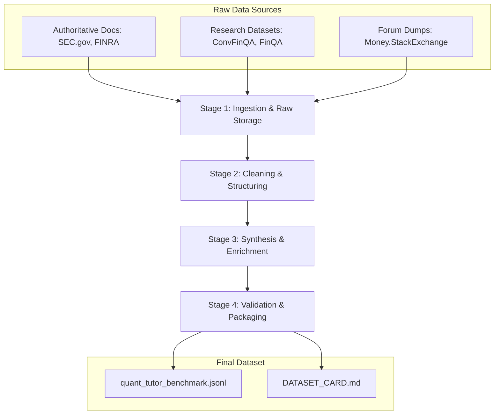

# Quant Tutor Benchmark: A Technical Implementation Plan

## 1. Project Overview & Objectives

This document provides a comprehensive, actionable plan for the engineering team to construct the **Quant Tutor Evaluation Dataset**. The goal is to create a high-quality, structured dataset for benchmarking a supportive AI agent designed to help users learn quantitative finance.

This plan is based on the "Critique-and-Refine" methodology inspired by the ICLR 2026 paper on `RebuttalBench` (arXiv:2601.15715). The final dataset will not be a simple collection of Question-Answer pairs, but a rich, structured corpus that captures the **reasoning process** of effective tutoring.

**Primary Objective**: To produce a multi-part dataset in JSONL format, with each record containing a user query, a "Learner Profile" analysis, a "Tutoring Strategy," and a "Generated Response."

## 2. High-Level Architecture & Data Flow

The data pipeline consists of four main stages, moving from raw, unstructured data to a refined, structured benchmark dataset.



## 3. Recommended Project Structure

A well-organized repository is crucial for a data-centric project. This structure separates raw data, scripts, and outputs, facilitating reproducibility and collaboration.

```bash
quant-tutor-dataset/
├── data/                     # Directory for all data files
│   ├── 00_raw/               # Raw, unmodified data from sources
│   │   ├── finra/
│   │   └── money.stackexchange.com/
│   ├── 01_ingested/          # Raw data converted to a consistent format (e.g., JSONL)
│   ├── 02_structured/        # Cleaned and structured Q&A pairs
│   ├── 03_synthesized/       # Enriched data with Profile, Strategy, Response
│   └── 04_packaged/          # Final, validated benchmark dataset
│
├── notebooks/                # Jupyter notebooks for exploration and analysis
│   └── 01_eda_stack_exchange.ipynb
│
├── scripts/                  # All Python scripts for the pipeline
│   ├── 01_ingest/            # Scripts to fetch and convert raw data
│   │   └── ingest_finra.py
│   ├── 02_structure/         # Scripts to clean and create Q&A pairs
│   │   └── structure_qa.py
│   ├── 03_synthesize/        # Scripts for the TSR synthesis step
│   │   └── synthesize_tsr.py
│   ├── 04_validate/          # Scripts for final data validation
│   │   └── validate_schema.py
│   └── lib/                  # Shared utility functions (e.g., LLM API calls)
│       └── llm_utils.py
│
├── configs/                  # Configuration files (e.g., API keys, prompts)
│   └── prompts.yaml
│
├── .env.template             # Template for environment variables
├── .gitignore
├── requirements.txt          # Python dependencies
└── README.md                 # Project documentation
```

## 4. Final Data Schema

The final output will be a JSONL file (`quant_tutor_benchmark.jsonl`), where each line is a JSON object representing a single, complete data point. This schema is designed to be self-contained and highly informative.

```json
{
  "id": "string", // Unique identifier for the data point (e.g., a UUID)
  "source_id": "string", // Identifier from the original source (e.g., Stack Exchange question ID)
  "source_dataset": "string", // Name of the source dataset (e.g., "money.stackexchange", "finra")
  "source_url": "string", // URL to the original source, if available
  "metadata": {
    "tags": ["string"], // Tags from the source (e.g., "investing", "stocks")
    "creation_date": "string", // ISO 8601 date from the source
    "provenance": "string" // Description of the data's origin and processing history
  },
  "question": {
    "title": "string", // The title of the question, if applicable
    "body": "string" // The full text of the user's question
  },
  "synthesis": {
    "teacher_model": "string", // The model used for synthesis (e.g., "gpt-4.1-mini")
    "learner_profile": "string", // The generated analysis of the user's knowledge/misconceptions
    "tutoring_strategy": "string", // The generated step-by-step teaching strategy
    "generated_response": "string" // The final, synthetic response generated based on the strategy
  }
}
```


## 5. Detailed Implementation Plan: Stage by Stage

This section provides technical specifications for the scripts in the `/scripts/` directory.

### Stage 1: Ingestion & Raw Storage (`/scripts/01_ingest/`)

**Objective**: To fetch raw data from all sources and store it locally in `data/00_raw/` with minimal modification. This stage ensures we have a persistent, local copy of the original data.

**`ingest_stack_exchange.py`**
*   **Action**: Download the `money.stackexchange.com.7z` file from the Internet Archive link provided.
*   **Implementation**: Use the `requests` library to download the file. Use `py7zr` to decompress the archive.
*   **Input**: URL to the Stack Exchange data dump.
*   **Output**: The script should place `Posts.xml`, `Users.xml`, `Tags.xml`, etc., into `data/00_raw/money.stackexchange.com/`.
*   **Note**: This is a large file. Implement streaming and chunking for the download.

**`ingest_research_datasets.py`**
*   **Action**: Download the FiQA, FinQA, TAT-QA, and ConvFinQA datasets from their respective sources.
*   **Implementation**: These are typically available as direct downloads (JSON, CSV). Use `requests` or `gdown` as appropriate.
*   **Input**: A list of URLs to the dataset files.
*   **Output**: Place the original dataset files into `data/00_raw/fiqa/`, `data/00_raw/finqa/`, etc.

**`ingest_authoritative_docs.py`**
*   **Action**: Scrape the educational pages from SEC Investor.gov, CFPB, and FINRA.
*   **Implementation**: Use `requests` to fetch the HTML and `BeautifulSoup4` to parse it. Be respectful and implement rate limiting (e.g., `time.sleep(1)`) between requests. Adhere to `robots.txt`.
*   **Input**: A list of seed URLs for the educational sections of these websites.
*   **Output**: Save the raw HTML content of each page to `data/00_raw/finra/page_name.html`.

### Stage 2: Cleaning & Structuring (`/scripts/02_structure/`)

**Objective**: To process the raw, heterogeneous data from Stage 1 into a unified Question-Answer JSONL format. The output of this stage is a clean, intermediate dataset ready for LLM synthesis.

**`structure_stack_exchange.py`**
*   **Action**: Parse the `Posts.xml` file and convert high-quality questions and their accepted answers into a structured format.
*   **Implementation**:
    1.  Use `xml.etree.ElementTree.iterparse` for memory-efficient parsing of the large XML file.
    2.  Create a dictionary to hold posts, keyed by their `Id`.
    3.  Iterate through the XML. If a post is a question (`PostTypeId=
1"`), save it.
    4.  If a post is an answer (`PostTypeId="2"`), save it.
    5.  After parsing, iterate through the questions. For each question that meets a quality threshold (e.g., `Score > 5`) and has an `AcceptedAnswerId`, find the corresponding answer post.
    6.  Convert the HTML body of the question and answer to clean Markdown using a library like `markdownify`.
    7.  Construct a JSON object containing `source_id`, `title`, `question_body`, `answer_body`, `tags`, `creation_date`, etc.
    8.  Write each JSON object as a new line to `data/01_structured/stack_exchange.jsonl`.

**`structure_research_datasets.py`**
*   **Action**: Unify the various research dataset formats into the common Q&A schema.
*   **Implementation**: This script will contain separate parser functions for each dataset (e.g., `parse_convfinqa`, `parse_finqa`). Each function will read its respective source file, extract the relevant fields (question, answer, context), and map them to the standard schema. For conversational datasets like ConvFinQA, ensure the full conversational history is preserved in the `question_body` or `metadata`.
*   **Output**: A single `data/01_structured/research_datasets.jsonl` file.

**`structure_authoritative_docs.py`**
*   **Action**: Convert the scraped HTML pages into structured Q&A pairs.
*   **Implementation**: For each HTML file, use `BeautifulSoup4` to extract the main text content. Use a combination of heuristics (e.g., `<h2>` tags are questions, subsequent `<p>` tags are answers) and a simple LLM call with a prompt like "Convert the following text into a series of distinct question-answer pairs in JSON format." to structure the content.
*   **Output**: `data/01_structured/authoritative_docs.jsonl`.

### Stage 3: Synthesis & Enrichment (`/scripts/03_synthesize/`)

**Objective**: To enrich the structured Q&A pairs with the three-part synthesis (`Learner Profile`, `Tutoring Strategy`, `Generated Response`) using LLM calls.

**`synthesize_tsr.py`**
*   **Action**: Read the structured JSONL files from the previous stage and generate the three synthesis components for each entry.
*   **Implementation**:
    1.  **Define Prompts**: In `configs/prompts.yaml`, create detailed, role-based prompts for each generation step. For example:
        *   `learner_profile_prompt`: "You are an expert cognitive analyst. Based on the following user question, create a profile of the learner. Infer their likely knowledge level (beginner, intermediate, advanced), their primary goal, and any potential misconceptions they might have..."
        *   `tutoring_strategy_prompt`: "You are an expert curriculum designer. Given the user's question and their learner profile, devise a step-by-step pedagogical strategy to answer their question effectively..."
        *   `response_generation_prompt`: "You are a helpful and engaging Quant Tutor. Using the provided user question, learner profile, and tutoring strategy, write a clear, accurate, and encouraging response that executes the strategy perfectly..."
    2.  **LLM Utility**: In `scripts/lib/llm_utils.py`, create a robust function `call_llm(prompt, model)` that handles API calls (using `openai` library), manages API keys from environment variables (`os.getenv("OPENAI_API_KEY")`), and implements exponential backoff for retries.
    3.  **Main Loop**: The script should iterate through the combined structured data. For each record:
        a.  Randomly select a "teacher model" from a list (e.g., `['gpt-4.1-mini', 'gemini-2.5-flash']`) to ensure diversity.
        b.  Call the LLM with the `learner_profile_prompt`.
        c.  Call the LLM with the `tutoring_strategy_prompt`, feeding it the original question and the newly generated profile.
        d.  Call the LLM with the `response_generation_prompt`, feeding it all the preceding information.
        e.  Assemble the final JSON object according to the schema in Section 4.
    4.  **Asynchronous Processing**: To manage the high volume of API calls efficiently, use `asyncio` and `aiohttp` to make concurrent requests to the LLM API.
    5.  **Checkpointing**: Save progress after every N records. The script must be able to resume from the last saved checkpoint to handle interruptions.
*   **Output**: `data/02_synthesized/synthesized_data.jsonl`.

### Stage 4: Validation & Packaging (`/scripts/04_validate/`)

**Objective**: To perform final quality checks and package the dataset for release.

**`validate_schema.py`**
*   **Action**: Validate every record in the synthesized dataset against the final JSON schema.
*   **Implementation**: Use a schema validation library like `Pydantic`. Define a Pydantic model that matches the final data schema. Iterate through `synthesized_data.jsonl`, load each line as JSON, and parse it with the Pydantic model. Log any validation errors.
*   **Output**: A validation report. If successful, copy the validated file to `data/03_packaged/quant_tutor_benchmark.jsonl`.

**`create_dataset_card.py`**
*   **Action**: Generate a `DATASET_CARD.md` file that documents the dataset.
*   **Implementation**: The script should calculate and report key statistics: total number of records, distribution of sources, distribution of teacher models, average text lengths for each field, etc. It should also include the final schema definition and a description of the dataset's creation process.
*   **Output**: `data/03_packaged/DATASET_CARD.md`.

## 6. Quality Assurance and Validation

1.  **Unit Tests**: Implement unit tests for helper functions, especially the parsers in Stage 2.
2.  **Schema Enforcement**: Use Pydantic models at each stage to ensure data conforms to the expected schema as it flows through the pipeline.
3.  **Human-in-the-Loop (HITL)**: Before the full synthesis run (Stage 3), process a small, random sample of 100 records and have a human expert review the generated `learner_profile` and `tutoring_strategy`. This is crucial for prompt tuning and ensuring the LLM is capturing the correct intent.
4.  **Provenance Tracking**: Ensure that every record in the final dataset has a clear `source_id` and `source_dataset` field, making it traceable back to its origin.

This implementation plan provides a clear and structured path for your engineering team to build a high-quality, research-grade evaluation dataset. The key to success will be the rigorous application of the synthesis framework and a strong focus on data quality at every stage.


---

## 7. Task Breakdown & Dependencies

This section provides a granular task list suitable for project management tools like Jira or Linear.

| Task ID | Task Name | Dependencies | Estimated Effort | Priority |
| :--- | :--- | :--- | :--- | :--- |
| **T1.0** | **Stage 1: Ingestion** | - | - | - |
| T1.1 | Download Stack Exchange data dump | None | 2 hours | P0 |
| T1.2 | Download research datasets (FiQA, FinQA, ConvFinQA, TAT-QA) | None | 2 hours | P0 |
| T1.3 | Scrape SEC Investor.gov pages | None | 4 hours | P1 |
| T1.4 | Scrape CFPB educational pages | None | 4 hours | P1 |
| T1.5 | Scrape FINRA educational pages | None | 4 hours | P1 |
| **T2.0** | **Stage 2: Structuring** | - | - | - |
| T2.1 | Implement `structure_stack_exchange.py` | T1.1 | 8 hours | P0 |
| T2.2 | Implement `structure_research_datasets.py` | T1.2 | 8 hours | P0 |
| T2.3 | Implement `structure_authoritative_docs.py` | T1.3, T1.4, T1.5 | 8 hours | P1 |
| T2.4 | Write unit tests for Stage 2 parsers | T2.1, T2.2, T2.3 | 4 hours | P1 |
| **T3.0** | **Stage 3: Synthesis** | - | - | - |
| T3.1 | Design and write LLM prompts in `prompts.yaml` | None | 8 hours | P0 |
| T3.2 | Implement `llm_utils.py` (API calls, retries, async) | None | 4 hours | P0 |
| T3.3 | Implement `synthesize_tsr.py` main loop | T3.1, T3.2, T2.1, T2.2 | 16 hours | P0 |
| T3.4 | Run pilot synthesis on 100 samples for HITL review | T3.3 | 4 hours | P0 |
| T3.5 | Iterate on prompts based on HITL feedback | T3.4 | 8 hours | P0 |
| T3.6 | Run full synthesis on all structured data | T3.5 | 24+ hours (compute) | P0 |
| **T4.0** | **Stage 4: Validation & Packaging** | - | - | - |
| T4.1 | Implement `validate_schema.py` with Pydantic | T3.6 | 4 hours | P0 |
| T4.2 | Implement `create_dataset_card.py` | T4.1 | 4 hours | P1 |
| T4.3 | Final human review and sign-off | T4.2 | 8 hours | P0 |

---

## 8. Environment Setup & Dependencies

The following `requirements.txt` file lists the core Python dependencies for this project.

```text
# requirements.txt

# Data Handling
pandas>=2.0.0
pydantic>=2.0.0

# Web Scraping & Parsing
requests>=2.28.0
beautifulsoup4>=4.12.0
markdownify>=0.11.0
lxml>=4.9.0

# File Handling
py7zr>=0.20.0  # For decompressing Stack Exchange dump

# LLM API Interaction
openai>=1.0.0
aiohttp>=3.8.0  # For async API calls
tenacity>=8.0.0  # For retry logic

# Utilities
python-dotenv>=1.0.0  # For managing environment variables
tqdm>=4.65.0  # For progress bars
pyyaml>=6.0.0  # For reading config files

# Testing
pytest>=7.0.0
```

---

## 9. Key Prompts for Synthesis (Example Templates)

These are starting points for the prompts in `configs/prompts.yaml`. They should be refined during the HITL review phase (Task T3.4).

### `learner_profile_prompt`

```yaml
learner_profile_prompt: |
  You are an expert cognitive analyst specializing in financial education.
  Your task is to analyze a user's question and create a detailed profile of the learner.

  **User Question:**
  ---
  {question}
  ---

  Based on this question, please provide a JSON object with the following fields:
  - "knowledge_level": One of "beginner", "intermediate", or "advanced".
  - "primary_goal": A brief statement of what the user is trying to achieve.
  - "potential_misconceptions": A list of any incorrect assumptions or confusions the user might have.
  - "key_concepts_to_address": A list of the core financial concepts that need to be explained.

  Respond ONLY with the JSON object.
```

### `tutoring_strategy_prompt`

```yaml
tutoring_strategy_prompt: |
  You are an expert curriculum designer for financial education.
  Your task is to devise a step-by-step pedagogical strategy to answer a user's question.

  **User Question:**
  ---
  {question}
  ---

  **Learner Profile:**
  ---
  {learner_profile}
  ---

  Based on the question and the learner's profile, create a numbered list of 3-5 steps that a tutor should follow to provide an effective answer. Consider the following:
  - Should the tutor start with an analogy or a formal definition?
  - Should the tutor provide a code example?
  - How should the tutor address the potential misconceptions?

  Respond ONLY with the numbered list.
```

### `response_generation_prompt`

```yaml
response_generation_prompt: |
  You are a helpful, patient, and engaging Quant Tutor.
  Your task is to write a response to a user's question by following a specific tutoring strategy.

  **User Question:**
  ---
  {question}
  ---

  **Learner Profile:**
  ---
  {learner_profile}
  ---

  **Tutoring Strategy:**
  ---
  {tutoring_strategy}
  ---

  Now, write a clear, accurate, and encouraging response that executes the tutoring strategy step-by-step. Use simple language appropriate for the learner's knowledge level. If the strategy calls for a code example, provide one in Python.
```

---

## 10. Appendix: Filtering Criteria

To ensure data quality, the following filtering rules should be applied during Stage 2.

| Source | Filter Criteria |
| :--- | :--- |
| **Money.StackExchange** | `Score >= 5` AND `AcceptedAnswerId IS NOT NULL`. This ensures we only use well-received questions with a community-validated answer. |
| **Research Datasets** | Keep all records from the official train/dev/test splits. Do not apply additional filtering. |
| **Authoritative Docs** | Exclude pages that are purely navigational (e.g., site maps, index pages). Keep only pages with substantive educational content (e.g., word count > 200). |
